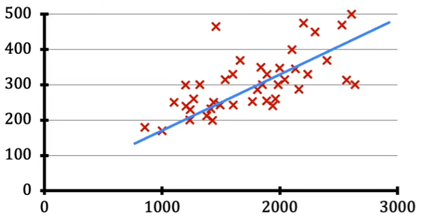
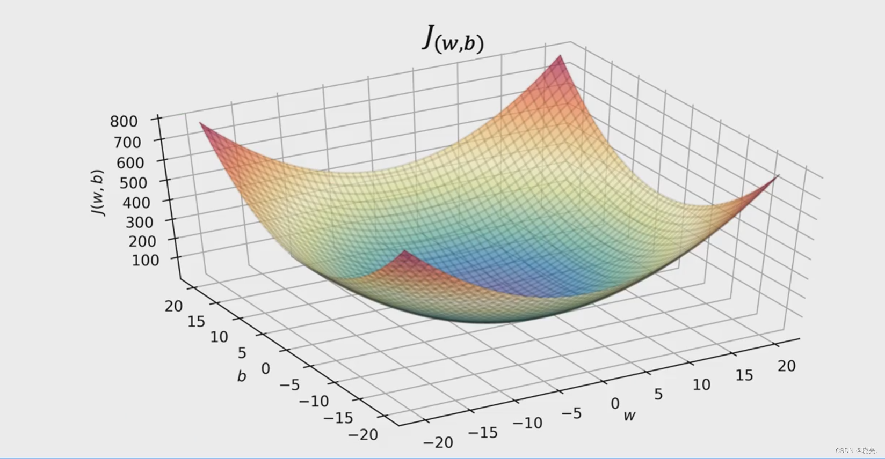
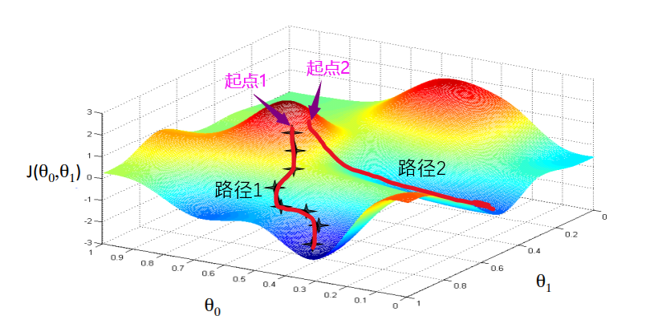
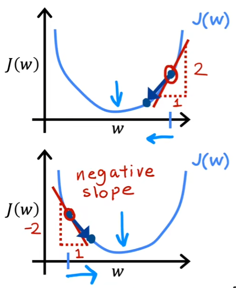

# 吴恩达机器学习

网课链接：https://www.bilibili.com/video/BV1Pa411X76s?p=1&vd_source=8566cec36593b0e28ee03f3c724b87d0

课后习题链接：https://github.com/fengdu78/Coursera-ML-AndrewNg-Notes/tree/f2757f85b99a2b800f4c2e3e9ea967d9e17dfbd8

# 定义

- 监督学习
- 无监督学习
- 半监督学习

# 章节

## 线性回归

### 目的

通过数据计算出一条尽可能符合数据的函数
$$
f_{w,b} = wx+b
$$

### 代价函数

使用代价函数来评判当前函数的拟合程度，代价越低拟合程度越好。（一般使用二维图像和等高线表示）

机器学习的目的就是找到代价函数的最低点，即最小值。

$$
J(w,b)=\frac{1}{2m}\sum_{i=1}^{m}(\bar{y}^{(i)}-y^{(i)})^2 \\
其中：\bar{y}^{(i)} = f_{w,b} (x^{(i)}) \\
J(w,b)=\frac{1}{2m}\sum_{i=1}^{m}(f_{w,b} (x^{(i)})-y^{(i)})^2
$$

### 梯度下降

梯度下降算法是用来快速确定函数中的最小值。

$$
w = w - \alpha \frac{d}{dw} J(w,b) \\
b = b - \alpha \frac{d}{db} J(w,b) \\
\alpha 就是学习率
$$
当起始点再最小值的右边， 斜率为正计算出的偏导数也是正数，更新后的参数会后移靠近最小值。反之同理。

对于学习率（0~1之间），若太小每次更新的距离太短导致迭代时间太长，若大太则有可能直接跨过最低点到另一边从而无法收敛。

### 公式汇总

函数模型，其中x和y来源于数据，w和b是待求解的参数：
$$
f_{w,b} = wx+b
$$
代价函数，用于评估w和b的代价，越低拟合程度越好：
$$
J(w,b)=\frac{1}{2m}\sum_{i=1}^{m}(f_{w,b} (x^{(i)})-y^{(i)})^2
$$
梯度下降算法，用于快速的计算最优的w和b
$$
w = w - \alpha \frac{d}{dw} J(w,b) \\
b = b - \alpha \frac{d}{db} J(w,b) \\
$$
将代价函数带入梯度下降算法并计算偏导数后的表达式为：
$$
w = w - \alpha \frac{1}{m}\sum_{i=1}^{m}(f_{w,b} (x^{(i)})-y^{(i)})x^{(i)} \\
b = b - \alpha \frac{1}{m}\sum_{i=1}^{m}(f_{w,b} (x^{(i)})-y^{(i)}) \\
$$
计算过程如下：
$$
\frac{d}{dw} J(w,b)
& = \frac{d}{dw}\frac{1}{2m}\sum_{i=1}^{m}(f_{w,b} (x^{(i)})-y^{(i)})^2 \\
& = \frac{d}{dw}\frac{1}{2m}\sum_{i=1}^{m}(wx^{(i)}+b-y^{(i)})^2 \\
& = \frac{1}{2m}\sum_{i=1}^{m}(wx^{(i)}+b-y^{(i)})2x^{(i)} \\
& = \frac{1}{m}\sum_{i=1}^{m}(wx^{(i)}+b-y^{(i)})x^{(i)} \\
\frac{d}{db} J(w,b)
& = \frac{d}{db}\frac{1}{2m}\sum_{i=1}^{m}(f_{w,b} (x^{(i)})-y^{(i)})^2 \\
& = \frac{d}{db}\frac{1}{2m}\sum_{i=1}^{m}(wx^{(i)}+b-y^{(i)})^2 \\
& = \frac{1}{2m}\sum_{i=1}^{m}(wx^{(i)}+b-y^{(i)})2 \\
& = \frac{1}{m}\sum_{i=1}^{m}(wx^{(i)}+b-y^{(i)}) \\
$$
