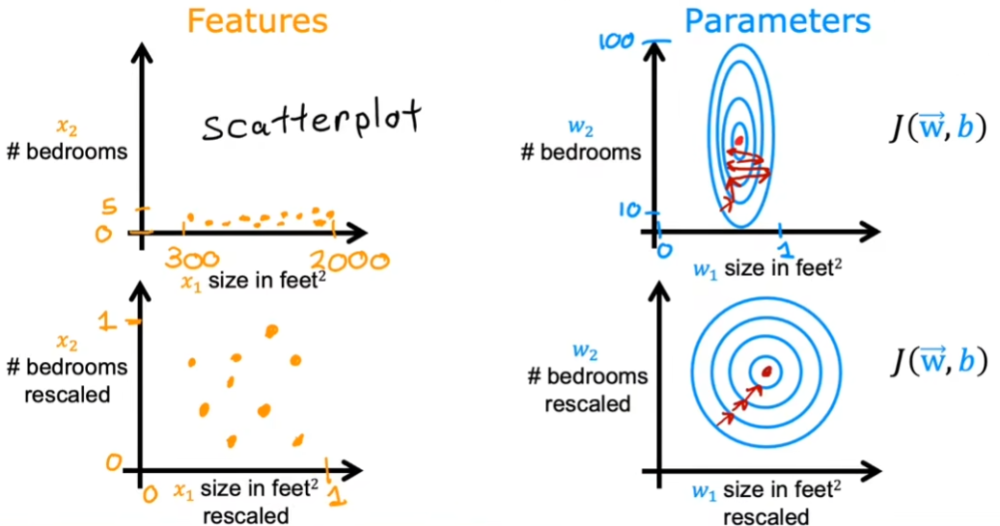
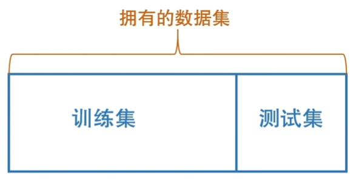
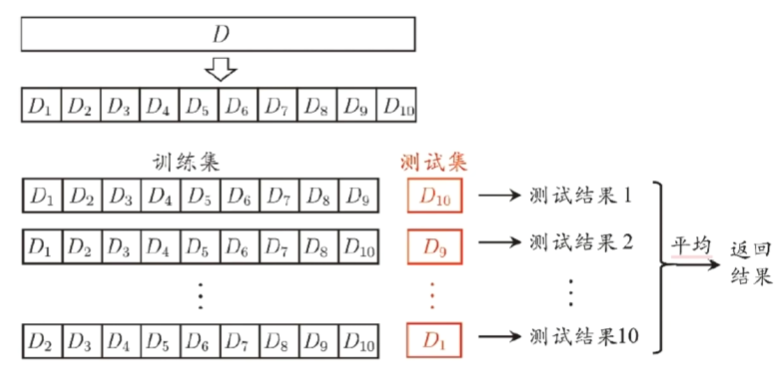
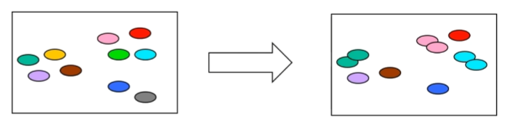
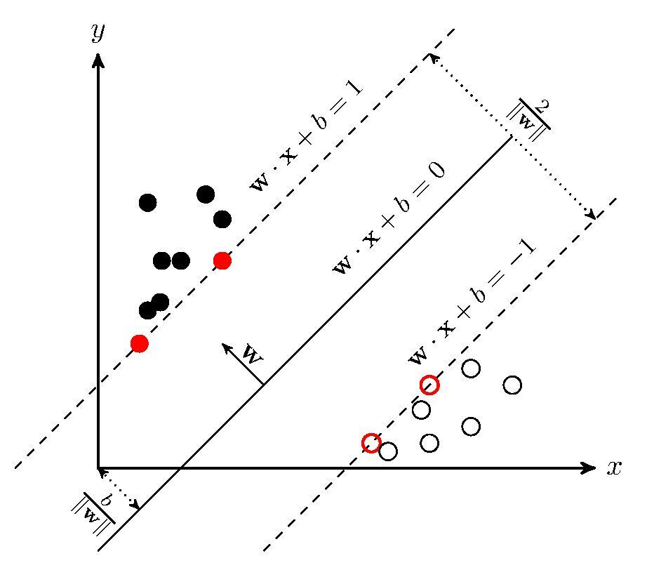
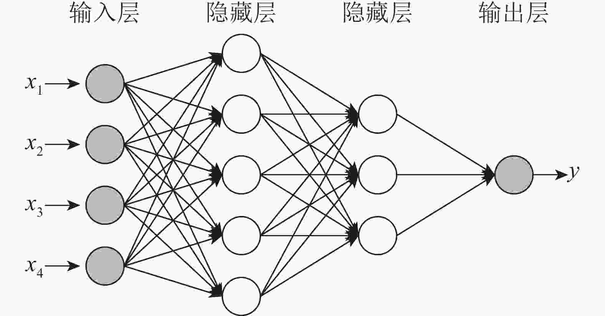
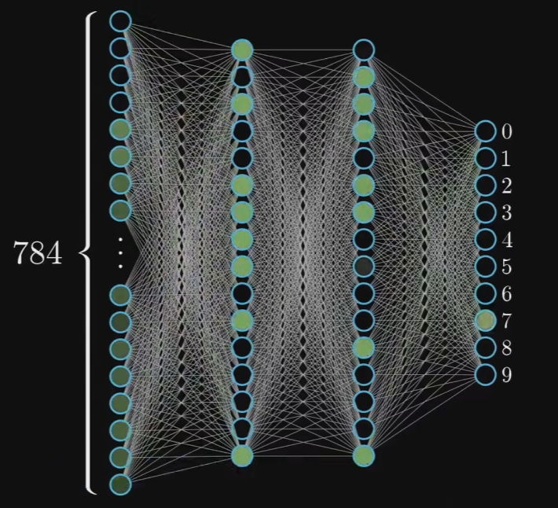

# 机器学习

“Field of study that gives computers the ability to learn without being explicitly programmed.”——arthur Samuel (1959)

- 学习路线：[纯新手自学入门机器/深度学习指南（附一个月速成方案） - 知乎 (zhihu.com)](https://zhuanlan.zhihu.com/p/37349519)
- 网课链接
  - [吴恩达机器学习](https://www.bilibili.com/video/BV1Pa411X76s?p=1&vd_source=8566cec36593b0e28ee03f3c724b87d0)
  - [周志华老师西瓜书](https://www.bilibili.com/video/BV1gG411f7zX?p=1)
  - [3Blue1Brown深度学习]([【官方双语】深度学习之神经网络的结构 Part 1 ver 2.0_哔哩哔哩_bilibili](https://www.bilibili.com/video/BV1bx411M7Zx/?spm_id_from=333.999.0.0&vd_source=8566cec36593b0e28ee03f3c724b87d0))
- 资料来源
  - [吴恩达机器学习实验室]([kaieye/2022-Machine-Learning-Specialization (github.com)](https://github.com/kaieye/2022-Machine-Learning-Specialization/tree/main))
  - [吴恩达机器学习笔记]([fengdu78/Coursera-ML-AndrewNg-Notes: 吴恩达老师的机器学习课程个人笔记 (github.com)](https://github.com/fengdu78/Coursera-ML-AndrewNg-Notes/tree/master))
  - [机器学习中的数学——激活函数](https://blog.csdn.net/hy592070616/article/details/120617176)
  - 神经网络和深度学习的在线书籍
    - 英文版：[Neural networks and deep learning](http://neuralnetworksanddeeplearning.com/)
    - 中文版：[引言 | 神经网络与深度学习 (gitbooks.io)](https://tigerneil.gitbooks.io/neural-networks-and-deep-learning-zh/content/)
  - [Christopher Olah的博客](https://colah.github.io/)


# 分类

- 监督学习（Supervised learning）：回归、分类
- 无监督学习（Unsupervised learning）：聚类、异常检测、降维
- 强化学习（Reinforcement learning）


# 基础概念

## 过拟合欠拟合

- 过拟合：指训练误差和测试误差之间的差距太大。模型在训练集上表现很好，但在测试集上却表现很差。模型对训练集"死记硬背"，没有理解数据背后的规律，泛化能力差。
- 欠拟合：指模型不能在训练集上获得足够低的误差。模型复杂度低，模型在训练集上就表现很差，没法学习到数据背后的规律。

- 解决方法：
  - 收集更多的数据
  - 减少使用特征
  - 正则化：减少参数的大小


## 特征值缩放

特征值的大小会显著的影响到各自w系数的大小，为了提高机器学习的性能，避免特征值过大或过小，需要对特征值进行缩放。



名词解释：可以认为特征缩放包括归一化和标准化。


### 特征缩放

Feature Scaling
$$
x_{i, scaled} = \frac{x_{i}}{x_{max}}
$$


### 归一化

Normalization
$$
特征值的均值:\mu_{i} \\
x_{i, scaled} = \frac{x_{i} - \mu_{i}}{x_{max} - x_{min}}
$$


### 标准化

Standardization (Z-Score Normalization)
$$
特征值的标准差:\sigma_{i} \\
特征值的平均值:\bar{x}_{i} \\
x_{i, scaled} = \frac{x_{i} - \bar{x}_{i}}{\sigma_{i}}
$$


## 激活函数

### 线性函数

在回归任务中预测正负
$$
g(x) = x
$$


### Sigmoid函数

多用于二分类问题
$$
g(x) = \frac{1}{1 + e^{-x}} \\
0 < g(x) < 1
$$


### 线性整流函数ReLU

在回归任务中g(x)只有负值
$$
g(z) = max(0, x)
$$


# 评估方法

- 留出法：在数据集中流出一部分用于测试集
  
  
  
  - 保持数据分布一致性（例如：分层采样)
  - 多次重复划分（例如：100次随机划分）
  - 测试集不能太大、不能太小（例如：1/5~1/3）
  - 通过训练集训练的数据经测试集测试后，应将所有数据一起再训练得到最终模型
  
- k-折交叉验证法：

  

- 自助法：随机复制数据中的部分数据（约36.8%的数据不会出现）

  


# 线性回归

## 目的

通过数据计算出一条尽可能符合数据的函数


## 代价函数

使用代价函数来评判当前函数的拟合程度，代价越低拟合程度越好。（一般使用二维图像和等高线表示）

机器学习的目的就是找到代价函数的最低点，即最小值。


## 梯度下降

梯度下降算法是用来快速确定函数中的最小值。


当起始点再最小值的右边， 斜率为正计算出的偏导数也是正数，更新后的参数会后移靠近最小值。反之同理。


## 单特征值公式

函数模型：其中x和y来源于数据，w和b是待求解的参数
$$
f_{w,b}(x) = wx+b
$$
代价函数：用于评估w和b的代价，越低拟合程度越好
$$
J(w,b)=\frac{1}{2m}\sum_{i=1}^{m}(f_{w,b} (x^{(i)})-y^{(i)})^2
$$
梯度下降算法：用于快速的计算最优的w和b（其中的alpha就是学习率）
$$
w = w - \alpha \frac{d}{dw} J(w,b) \\
b = b - \alpha \frac{d}{db} J(w,b) \\
$$
将代价函数带入梯度下降算法并计算偏导数后的表达式为：
$$
w = w - \alpha \frac{1}{m}\sum_{i=1}^{m}(f_{w,b} (x^{(i)})-y^{(i)})x^{(i)} \\
b = b - \alpha \frac{1}{m}\sum_{i=1}^{m}(f_{w,b} (x^{(i)})-y^{(i)}) \\
$$
求偏导过程如下：
$$
\frac{d}{dw} J(w,b)
& = \frac{d}{dw}\frac{1}{2m}\sum_{i=1}^{m}(f_{w,b} (x^{(i)})-y^{(i)})^2 \\
& = \frac{d}{dw}\frac{1}{2m}\sum_{i=1}^{m}(wx^{(i)}+b-y^{(i)})^2 \\
& = \frac{1}{2m}\sum_{i=1}^{m}(wx^{(i)}+b-y^{(i)})2x^{(i)} \\
& = \frac{1}{m}\sum_{i=1}^{m}(wx^{(i)}+b-y^{(i)})x^{(i)} \\
\frac{d}{db} J(w,b)
& = \frac{d}{db}\frac{1}{2m}\sum_{i=1}^{m}(f_{w,b} (x^{(i)})-y^{(i)})^2 \\
& = \frac{d}{db}\frac{1}{2m}\sum_{i=1}^{m}(wx^{(i)}+b-y^{(i)})^2 \\
& = \frac{1}{2m}\sum_{i=1}^{m}(wx^{(i)}+b-y^{(i)})2 \\
& = \frac{1}{m}\sum_{i=1}^{m}(wx^{(i)}+b-y^{(i)}) \\
$$


## 多特征值公式

函数模型：
$$
f_{\vec{w},b}(\vec{x}) = w_{1}x_{1}+...+w_{n}x_{n}+b \\
\vec{w} = [w_{1} ... w_{n}] \\
\vec{x} = [x_{1} ... x_{n}] \\
f_{\vec{w},b}(\vec{x}) = \vec{w}.\vec{x}+b
$$
代价函数：
$$
J(\vec{w},b)=\frac{1}{2m}\sum_{i=1}^{m}(f_{\vec{w},b}(\vec{x})-y^{(i)})^2
$$
梯度下降算法：
$$
w_{j} = w_{j} - \alpha \frac{d}{dw_{j}} J(\vec{w},b) \\
b = b - \alpha \frac{d}{db} J(\vec{w},b) \\
$$
将代价函数带入梯度下降算法并计算偏导数后的表达式为：
$$
w_{n} = w_{n} - \alpha \frac{1}{m}\sum_{i=1}^{m}(f_{\vec{w},b}(\vec{x}^{(i)})-y^{(i)})x_{n}^{(i)} \\
b = b - \alpha \frac{1}{m}\sum_{i=1}^{m}(f_{\vec{w},b}(\vec{x}^{(i)})-y^{(i)}) \\
$$


## 设置学习率

对于学习率（0~1之间），若太小每次更新的距离太短导致迭代时间太长，若大太则有可能直接跨过最低点到另一边从而无法收敛。

通过设置不同的学习率，并绘制部分迭代过程中的代价值图像，通过观察图像再选择一条最大的可收敛的曲线作为最后的学习率

>如：0.001   0.003   0.01   0.03   0.1   0.3   1


## 多项式回归

如果要拟合曲线则需要使用多项式的函数模型，如：
$$
f_{\vec{w},b}(x) = w_{1}x+w_{2}x^{2}+w_{3}x^{3}+...+b \\
f_{\vec{w},b}(x) = w_{1}x+w_{2}\sqrt{x}+b \\
$$


## 正则化

代价函数：
$$
J(\vec{w},b)=\frac{1}{2m}\sum_{i=1}^{m}(f_{\vec{w},b}(\vec{x})-y^{(i)})^2+\frac{\lambda}{2m}\sum_{j=1}^{n}w_{j}^{2}
$$
梯度下降算法：
$$
w_{j} = w_{j} - \alpha 
\left \{ 
\frac{1}{m}\sum_{i=1}^{m}[(f_{\vec{w},b} (\vec{x}^{(i)})-y^{(i)})x_{j}^{(i)}]+\frac{\lambda}{m}w_{j}
\right \}  \\

b = b - \alpha \frac{1}{m}\sum_{i=1}^{m}(f_{\vec{w},b}(\vec{x}^{(i)})-y^{(i)}) \\
$$
w项化简：
$$
w_{j} = w_{j}(1-\alpha\frac{\lambda}{m}) - \alpha \frac{1}{m}\sum_{i=1}^{m}(f_{\vec{w},b} (\vec{x}^{(i)})-y^{(i)})x_{j}^{(i)}
$$


# 逻辑回归

## 目的

不同与线性回归输出的值没有固定的范围，逻辑回归的输出有固定的几个值。如果使用函数输出固定值就需要用激活函数。通过函数尽量将不同的数据集划分开。


## 逻辑回归模型

这里的g()表示Sigmoid函数
$$
z = \vec{w}.\vec{x} + b \\
f_{\vec{w},b}(\vec{x}) = g(\vec{w}.\vec{x} + b) = \frac{1}{1 + e^{-(\vec{w}.\vec{x} + b)}}
$$

通常会设置一个值(threshold)，当逻辑函数的结果大于这个值则输出1，反之则输出0
$$
is \ f_{\vec{w},b}(\vec{x}) \ \ge \ threshold? \\
Yes: y = 1 \\
No: y = 0
$$

$$
When \ is \ f_{\vec{w},b}(\vec{x}) \ \ge \ threshold? \\
g(z) \ge threshold \\
z  \ge threshold \\
\vec{w}.\vec{x} + b \ge threshold \\
y = 1 \\
\vec{w}.\vec{x} + b < threshold \\
y = 0 \\
$$

其中z的表达式就是边界函数，需要根据不同的情况进行调整。


## 逻辑回归公式

函数模型：
$$
f_{\vec{w},b}(\vec{x}) = g(\vec{w}.\vec{x} + b) = \frac{1}{1 + e^{-(\vec{w}.\vec{x} + b)}}
$$
代价函数：
$$
J(\vec{w},b)=\frac{1}{m}\sum_{i=1}^{m}L(f_{\vec{w},b}(\vec{x}^{(i)},y^{(i)}) \\
L(f_{\vec{w},b}(\vec{x}^{(i)},y^{(i)}) = \left\{
\begin{aligned}
x = -log(f_{\vec{w},b}(\vec{x}^{(i)}) \quad\quad if \ y^{(i)}=1 \\
y = -log(1-f_{\vec{w},b}(\vec{x}^{(i)}) \quad if \ y^{(i)}=0 \\
\end{aligned}
\right.
$$

$$
J(\vec{w},b)=-\frac{1}{m}\sum_{i=1}^{m}[y^{(i)}log(f_{\vec{w},b}(\vec{x}^{(i)})+(1-y^{(i)})log(1-f_{\vec{w},b}(\vec{x}^{(i)})] \\
$$

梯度下降算法：
$$
w_{j} = w_{j} - \alpha \frac{d}{dw_{j}} J(\vec{w},b) \\
b = b - \alpha \frac{d}{db} J(\vec{w},b) \\
$$
将代价函数带入梯度下降算法并计算偏导数后的表达式为：
$$
w_{n} = w_{n} - \alpha \frac{1}{m}\sum_{i=1}^{m}(f_{\vec{w},b}(\vec{x}^{(i)})-y^{(i)})x_{n}^{(i)} \\
b = b - \alpha \frac{1}{m}\sum_{i=1}^{m}(f_{\vec{w},b}(\vec{x}^{(i)})-y^{(i)}) \\
$$


## 正则化

代价函数：
$$
J(\vec{w},b)=-\frac{1}{m}\sum_{i=1}^{m}[y^{(i)}log(f_{\vec{w},b}(\vec{x}^{(i)})+(1-y^{(i)})log(1-f_{\vec{w},b}(\vec{x}^{(i)})] + \frac{\lambda}{2m}\sum_{j=1}^{n}w_{j}^{2} \\
$$
梯度下降算法：
$$
w_{j} = w_{j} - \alpha 
\left \{ 
\frac{1}{m}\sum_{i=1}^{m}[(f_{\vec{w},b} (\vec{x}^{(i)})-y^{(i)})x_{j}^{(i)}]+\frac{\lambda}{m}w_{j}
\right \}  \\

b = b - \alpha \frac{1}{m}\sum_{i=1}^{m}(f_{\vec{w},b}(\vec{x}^{(i)})-y^{(i)}) \\
$$


# 决策树

越靠近根节点越在意数据的一般性区别，越靠近叶节点越在意数据细节。可以做分类也可以做回归。


## 衡量标准-熵

熵是表示随机变量不确定性的度量（即物体内部的混乱程度）

Ent(D)表示还需要多少信息量才能把数据集D划分干净
$$
Ent(D) = -\sum_{k=1}^{|y|}p_{k}log_{2}p_{k} \\
0 \le Ent(D) \le log_{2}|y|
$$

- D表示数据集
- |y|表示类别数量
- pk表示每种类型出现的概率


## 属性划分准则

通过一些原则来判断前后两次划分后数据是否变纯净。

信息增益与基尼指数产生的结果，仅在约2%的情况下不同。

  

### 信息增益ID3

以属性α对数据集D进行划分所获得的信息增益
$$
Gain(D,a) = Ent(D) - \sum_{v=1}^{V}\frac{|D^{v}|}{|D|}Ent(D^{v})
$$

- Dv表示D中在a上取值=av的样本集合

缺点：在面对ID这种唯一性的数据，信息增益会选择他作为跟节点划分，使得决策树丧失泛化性。


### 信息增益率C4.5

$$
Gain\underline{~}ratio(D,a) = \frac{Gain(D,a)}{IV(a)} \\
IV(a) = -\sum_{v=1}^{V}\frac{|D^{v}|}{|D|}log_{2}\frac{|D^{v}|}{|D|}
$$

- 分支越多，IV(a)越大
- 划分效果越好，Gain(D,a)越大
- Gain_ratio(D,a)要求Gain(D,a)越大的同时IV(a)越小，即划分效果好的情况下分支还少

启发式（信息增益和分支的取舍）：先从候选划分属性中找出信息增益高于平均水平的，再从中选取增益率最高的


### CART

基尼指数
$$
Gini(D) = \sum_{k=1}^{|y|} \sum_{k'\ne k}^{} = 1 - \sum_{k=1}^{|y|}p_{k}^{2} \\
Gini\underline{~}index(D,a) = \sum_{v=1}^{V}\frac{|D^{v}|}{|D|}Gini(D^{v})
$$

- Gini(D)越小，数据集D的纯度越高


## 剪枝

在数据带噪时甚至可能将泛化性能提升25%

- 预剪枝（pre-pruning）：通过限制深度，叶子节点个数，叶子节点样本数，信息增益量等，提前终止某些分支的生长。

- 后剪枝（post-pruning）：生成一颗完全树，再进行剪枝。
  $$
  C_{a}(T) = C(T) + \alpha |T_{leadf}|
  $$

  - Ca(T)表示损失
  - C(T)表示基尼指数
  - a表示平衡项
  - Tleaf表示叶子节点个数


# 贝叶斯分类器


# 支持向量机

## 目的

使用一个超平面将两类数据分开，同时要留有一定的间隔。




# 神经网络

## 结构




## 原理

来源于3Blue1Brown视频中的识别手写数字案例。

神经网络的输入是一个28*28大小的图片，其中每个像素的取值范围都是[0,1]，0表示黑色，1表示白色。


神经网络的结构如下，第0层有784个节点对应每个像素点，第1和第2层有16个节点，输出层是0到9的概率。



每个节点之间的线会有的对应的权重w，在节点内部会进行一个激活函数的计算，为了控制再多大权值下才会激发就需要一个参数b来控制激发阈值。
$$
单个节点内的公式：g(w_{1}a_{1} + w_{2}a_{2} + w_{3}a_{3} + ... + w_{n}a_{n} + b) \\
一层的运算：
a^{(l)} = g
\begin{pmatrix}
\begin{bmatrix}
 w_{0,0} & w_{0,1} & ... & w_{0,n} \\
 w_{1,0} & w_{1,1} & ... & w_{1,n} \\
 ... & ... & ... & ... \\
 w_{n,0} & w_{n,1} & ... & w_{n,n} \\
\end{bmatrix}
  &
\begin{bmatrix}
 a_{0}^{(l-1)} \\
 a_{1}^{(l-1)} \\
 ... \\
 a_{n}^{(l-1)} \\
\end{bmatrix}
  &
+
  &
\begin{bmatrix}
 b_{0} \\
 b_{1} \\
 ... \\
 b_{n} \\
\end{bmatrix}
\end{pmatrix} \\
使用向量表示：\vec{a}^{(l)} = g(\vec{w}^{(l)} . \vec{a}^{(l-1)} + b^{(l)})
$$
对于数字来说，一个数字就是各种抽象特征组合而成（如9是由圆圈和竖线组成、8是由两个圆圈组成），而抽象特征则是由更小的抽象特征组成（如圆圈是由多个小拐弯组成）。所以神经网络中隐藏层的任务就是，在第1层的节点中识别图像中小的抽象特征（如小拐弯、小竖线、小横线），在第2层的节点中识别图像中的抽象特征（如圆圈、竖线、直线），最后通过计算得出最有可能的数字是什么。

==以上内容并非是神经网络真正的原理，更像是人们希望神经网络是这样的原理，实际的情况要更加抽象一些。神经网络中的隐藏层之所以这样命名就是因为人们并不知道这其中到底在干什么，这虽然不妨碍实现数字识别但整个过程就想黑箱一样我们无从得知。一方面是因为仅仅上述的网络中就有1.3w的参数调整我们无法准确的解释，另一方面很多在数学上优化并不是为了提高可解释性贰十为了高效，以及一些其他原因==


## 向前传播


## 反向传播


# Scikit-Learn

## 六大功能

- 分类模型（Classification）
- 回归模型（Regression）
- 聚类模型（Clustering）
- 降维算法（Dimensionality reduction）
- 模型选择（Model selection）
- 数据预处理（Preprocessing）


## 数据预处理

### 数据切分

```python
from sklearn.model_selection import train_test_split

# 默认训练集和测试集比例为3：1
x_train, x_test, y_train, y_test = train_test_split(x, y, random_state=42)
```

| 超参数       | 默认值 | 描述                                      |
| ------------ | ------ | ----------------------------------------- |
| train_size   | 0.25   | 训练集的占比（0~1）                       |
| test_size    | None   | 测试集的占比（0~1）                       |
| random_state | None   | 随机种子                                  |
| shuffle      | True   | 是否打乱数据（False下stratify必须为None） |
| stratify     | None   | 控制训练集和测试集不同类别样本所占比例    |


### 标准化

```python
from sklearn.preprocessing import StandardScaler
 
scaler = StandardScaler()
# 计算训练集的均值和方差等数据
scaler.fit(x)
# 利用训练集的均值和方差对测试集进行标准化处理
scaler.transform(x)

# 二合一
scaler.fit_transform(x)
```

| 超参数    | 默认值 | 描述             |
| --------- | ------ | ---------------- |
| copy      | True   | 是否拷贝新的副本 |
| with_mean | True   | 是否减去均值     |
| with_std  | True   | 是否除以标准差   |

| 模型中的属性           | 描述                     |
| ---------------------- | ------------------------ |
| scaler.scale_          | 查看训练数据各列的标准差 |
| scaler.mean_           | 查看训练数据各列的均值   |
| scaler.var_            | 查看训练数据各列的方差   |
| scaler.n_samples_seen_ | 总共有效的训练数据条数   |


### 01标准化

```python
from sklearn.preprocessing import MinMaxScaler

scaler = MinMaxScaler()
scaler.fit_transform(x)
```

| 超参数        | 默认值 | 描述             |
| ------------- | ------ | ---------------- |
| feature_range | (0,1)  | 标准化范围       |
| axis          | 0      | 对行或对列       |
| copy          | True   | 是否拷贝新的副本 |

| 模型中的属性     | 描述                     |
| ---------------- | ------------------------ |
| scaler.data_min_ | 查看训练数据各列的标准差 |
| scaler.data_max_ | 查看训练数据各列的均值   |


### 归一化

```python
from sklearn.preprocessing import Normalize

normalize = Normalize()
normalize.fit_transform(x)
```

| 超参数 | 默认值 | 描述                                          |
| ------ | ------ | --------------------------------------------- |
| norm   | l2     | 用于规格化每个非零样本的范数。（l1, l2, max） |
| copy   | True   | 是否拷贝新的副本                              |


## 评估器

评估器就理解成一个个机器学习的模型，而sklearn的建模过程最核心的步骤就是围绕着评估器进行模型的训练。

第一步是实例化该对象，其次是围绕某数据进行模型训练。


## 线性回归评估器

```python
model = LinearRegression()
model.set_params(params=val)
```

| 超参数        | 默认值 | 描述                         |
| ------------- | ------ | ---------------------------- |
| fit_intercept | True   | 是否构建带有截距项的线性方程 |
| normalize     | False  | 是否进行正则化处理           |
| copy_X        | True   | 建模时是否带入训练数据的副本 |
| n_jobs        | None   | 设置工作时参与计算的CPU核数  |

| 模型中的属性     | 描述                   |
| ---------------- | ---------------------- |
| model.coef_      | 线性方程自变量系数     |
| model.intercept_ | 线性方程组截距项的系数 |
| model.rank_      | 特征矩阵的秩           |
| model.singular_  | 特征矩阵的奇异值       |


